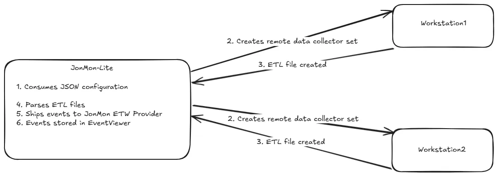

# JonMon-Lite
JonMon-Lite is a research proof-of-concept "Remote Agentless EDR" that creates an ETW Trace Session through a Data Collector Set. This session can be created locally or remotely. 

## Write-Up
A blog was written around this technology and can be found here: <Insert>

## Installation

JonMon-Lite is broken up into 4 pieces: 
1. JonMon-Lite.exe - resonsible for creation of data collection sets and collection
2. JonMon-Lite.json - configuration file
3. JonMon-Lite.xml - XML file that the data collector set will use
4. JonMon-Lite manifest files (.dll/.man) - needed to set up events in the Event Viewer

To execute: 
1. Update the JonMon-Lite.json to fit your environment (This assumes you are running this from Machine3): 
```
{
    "XMLFilePath": "C:\\Path\\To\\JonMon-Lite.xml",
    "ETLFilePath": "C:\\PerfLogs\\Admin\\JonMon-Lite\\",
    "RootPath": "\\Machine3\\C$\\PerfLogs\\Admin\\JonMon-Lite\\",
    "TraceName": "JonMon-Lite",
    "WorkstationName": ["Machine1", "Machine2"],
    "User": "TestUser",
    "Password": "ChangeMe1!"
    
}
```

Make sure that the user inserted in User and Password is an Administrator on all machines. If you want to test locally, you can simply do: 
```
{
    "XMLFilePath": "C:\\Path\\To\\JonMon-Lite.xml",
    "ETLFilePath": "C:\\PerfLogs\\Admin\\JonMon-Lite\\",
    "RootPath": "C:\\PerfLogs\\Admin\\JonMon-Lite\\",
    "TraceName": "JonMon-Lite",
    "WorkstationName": ["LocalMachineName"],
    "User": "",
    "Password": ""
    
}
```
Afterwards, simply run: `JonMon-Lite.exe` as an Administrator. You should see something like this: 
```
Reading JonMon-Lite Config File...

Uninstalling ETW Manifest
Installing ETW Manifest
XMLFilePath: C:\Users\thor\Desktop\JonMon-Lite\JonMon-Lite.xml
TraceName: JonMon-Lite
ETLFilePath C:\PerfLogs\Admin\JonMon-Lite\
RootPath: \\Asgard-Wrkstn\C$\PerfLogs\Admin\JonMon-Lite\
WorkstationName: Wakanda-Wrkstn
User: thor
Password: GodofLightning1!

Creating JonMon-Lite Trace...
XMLFilePath: C:\Users\thor\Desktop\JonMon-Lite\JonMon-Lite.xml
TraceName: JonMon-Lite
ETLFilePath C:\PerfLogs\Admin\JonMon-Lite\
RootPath: \\Asgard-Wrkstn\C$\PerfLogs\Admin\JonMon-Lite\
WorkstationName: Asgard-Wrkstn
User: thor
Password: GodofLightning1!

Processing events...
Creating JonMon-Lite Trace...
ETL file not found: C:\PerfLogs\Admin\JonMon-Lite\Wakanda-Wrkstn_\JonMon-Lite.etl, waiting 4 seconds...
Processing events...
ETL file not found: C:\PerfLogs\Admin\JonMon-Lite\Asgard-Wrkstn_\JonMon-Lite.etl, waiting 4 seconds...
Credentials set successfully.
Credentials set successfully.
pDataCollectorSet->put_RootPath was set successfully
pDataCollectorSet->put_RootPath was set successfully
pDataCollectorSet->SetXml was set successfully
pDataCollectorSet->SetXml was set successfully
Collector set 'JonMon-Lite' has been created/updated successfully.
Collector set 'JonMon-Lite' has been created/updated successfully.
Collector set 'JonMon-Lite' started successfully.
Collector set 'JonMon-Lite' started successfully
```

To stop the collection, simply go to the JonMon-Lite window and type "exit" and press enter. 

One thing to note - I don't manually clean up the ETL files, just in case someone wants to grab them, so before you start the next session - you will need to manually remove them. 

Below is a high level architecture of what happens upon running `JonMon-Lite.exe`:




## Events Collected

JonMon-Lite collects the following data: 
| EventType | Provider |
| --------- | --------- | 
| Process Creation | Microsoft-Windows-Kernel-Process |
| File Creation | Microsoft-Windows-Kernel-File |
| DotNetLoad| Microsoft-Windows-DotNETRuntime |
| WMIEventFilter | Microsoft-Windows-WMI-Activity |
| RPCClientCall	ETW | Microsoft-Windows-RPC |
| RPCServerCall | Microsoft-Windows-RPC |
| CryptUnprotectData |  Microsoft-Windows-Crypto-DPAPI |
| AMSI | Microsoft-Antimalware-Scan-Interface |


